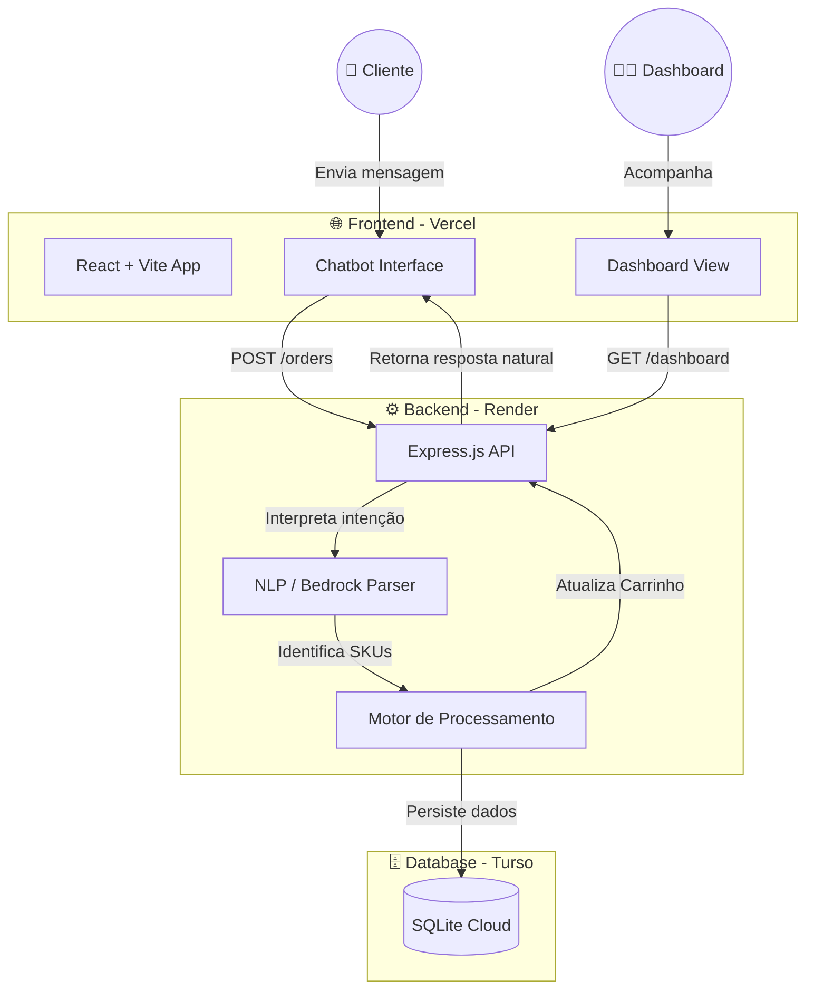

<div align="center">

# 🍕 Delivery AI — Assistente Virtual para Delivery

**Transformando mensagens naturais em pedidos reais através de Inteligência Artificial.**

[](https://react.dev/)
[](https://www.typescriptlang.org/)
[](https://nodejs.org/)
[](https://turso.tech/)
[](https://vercel.com/)
[](https://render.com/)

</div>

---

## 📖 Sobre o Projeto

O **Delivery AI** é um sistema completo (Full-Stack) projetado para automatizar o atendimento de restaurantes e pizzarias. Em vez de navegar por menus complexos, o cliente simplesmente conversa com um Chatbot Inteligente usando linguagem natural. O robô entende o pedido, valida os produtos no catálogo, monta o carrinho (com acúmulo e remoção de itens) e finaliza o pedido.

Tudo isso acompanhado de um Dashboard em tempo real para os administradores visualizarem métricas e pedidos entrando.

---

## 🏗️ Arquitetura e Fluxo do Sistema

O sistema adota uma arquitetura desacoplada baseada em APIs REST, permitindo escalar o Frontend e o Backend de forma independente.



---

## 🛠️ Tecnologias e Ferramentas

O ecossistema do projeto foi construído utilizando as ferramentas mais modernas do mercado:

### **Frontend**
- **React 19 & TypeScript:** Interfaces reativas, fortemente tipadas e à prova de falhas.
- **Vite:** Build tool ultrarrápida.
- **TailwindCSS & Shadcn UI:** Design System moderno, responsivo e componentizado.
- **Lucide Icons:** Ícones consistentes e otimizados.

### **Backend**
- **Node.js 20 & Express:** Servidor REST eficiente e escalável.
- **Esbuild:** Empacotador (bundler) de extrema performance que compila todo o backend em um único arquivo de distribuição.
- **Express CORS & Body-Parser:** Camadas de segurança e interpretação de JSON.

### **Banco de Dados**
- **Turso (LibSQL):** Banco de dados SQLite distribuído na borda (Edge). Extremamente rápido, ideal para sistemas serverless.

### **Deploy e Infraestrutura (Gratuito)**
- **Vercel:** Hospedagem global e instantânea para o Frontend.
- **Render:** Hospedagem na nuvem para a API (Web Service Node.js).
- **GitHub:** Versionamento contínuo com triggers automáticos de CI/CD para o Vercel e Render.

---

## 🔄 Fluxo de Pedido Passo a Passo

1. **Intenção Inicial:** Cliente diz `"Quero ver o cardápio"` ou `"Me vê 2 pizzas de calabresa e 1 coca"`.
2. **Interpretação:** O Backend analisa as palavras-chave (ou envia ao LLM) e extrai quantidades e IDs (SKUs).
3. **Validação:** O sistema consulta o catálogo interno. Se um item não existir, avisa o cliente.
4. **Carrinho (Merge):** O sistema soma itens novos aos existentes. Identifica comandos como *"tirar coca"* ou *"limpar carrinho"*.
5. **Cálculo de Preço:** Multiplica valores unitários e aplica taxa de entrega fixada.
6. **Confirmação:** Quando o cliente diz `"Pode fechar"`, o pedido é salvo no banco SQLite.
7. **Persistência:** Uma nota fiscal simulada é gerada, e o pedido entra no Dashboard de administração.

---

## 🚀 Deploy Gratuito — Vercel + Render + Turso

> Este projeto está configurado para ir ao ar em minutos sem custo algum.

### 1. Banco de dados — Turso (SQLite na nuvem)

1. Crie uma conta no painel do [Turso](https://app.turso.tech).
2. Clique em **Create Database** e crie um banco (ex: `delivery-ai`). Recomendamos a região *AWS Oregon*.
3. Copie a **URL** do banco.
4. Na mesma tela, clique em **Generate Token**, escolha a opção de nunca expirar e copie o **Token**.

### 2. Backend — Render

1. Acesse [render.com](https://render.com) e conecte seu GitHub.
2. Crie um **New Web Service** e conecte este repositório.
3. Configure:
   - **Root Directory:** `backend`
   - **Build Command:** `npm install && npm run build:server`
   - **Start Command:** `npm run start:prod`
4. Em **Environment Variables**, adicione:
   - `DATABASE_URL` (Sua URL do Turso)
   - `DATABASE_AUTH_TOKEN` (Seu token do Turso)
   - `ALLOWED_ORIGIN` (Será adicionada após o deploy do Vercel)
5. Clique em **Deploy**. Copie a URL gerada pelo Render.

### 3. Frontend — Vercel

1. Acesse [vercel.com](https://vercel.com) e conecte seu GitHub.
2. Crie um **New Project** importando este repositório.
3. Em **Environment Variables**, adicione:
   - `VITE_API_BASE_URL` (Sua URL gerada pelo Render no passo anterior)
4. Clique em **Deploy**. Copie a URL final do site (ex: `https://seu-site.vercel.app`).

### 4. Finalizar Segurança (CORS)

Volte ao Render, abra a aba **Environment** do seu backend e adicione a variável `ALLOWED_ORIGIN` colando a URL do seu Vercel (sem a barra `/` no final). Clique em Save Changes. **Pronto, o sistema está online!**

---

## 💻 Como Rodar Localmente (Desenvolvimento)

Caso queira baixar e rodar o projeto no seu computador:

1. Clone o repositório e instale as dependências na raiz e no backend:
```bash
npm install
cd backend && npm install
```

2. Volte para a raiz do projeto e inicie ambos (Frontend e Backend) simultaneamente:
```bash
npm run dev:all
```

- **Frontend:** http://localhost:8080
- **Backend:** http://localhost:3001
- O banco de dados SQLite será criado automaticamente como um arquivo local `orders.db` na pasta do backend.

---

## 📄 Licença

Distribuído sob a licença MIT. Sinta-se livre para usar, estudar e modificar.

<div align="center">

**⭐ Se esse projeto te inspirou, deixa uma estrela no repositório!**

</div>
