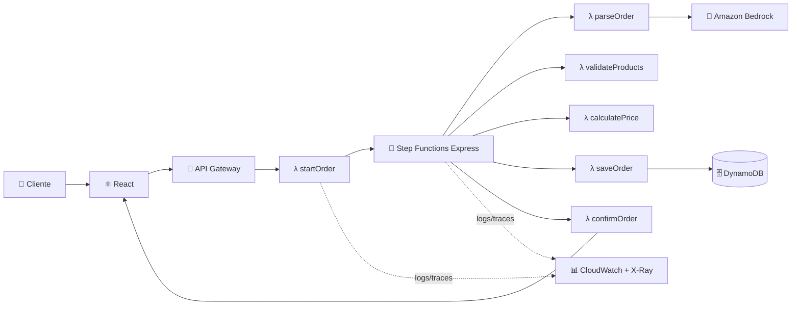
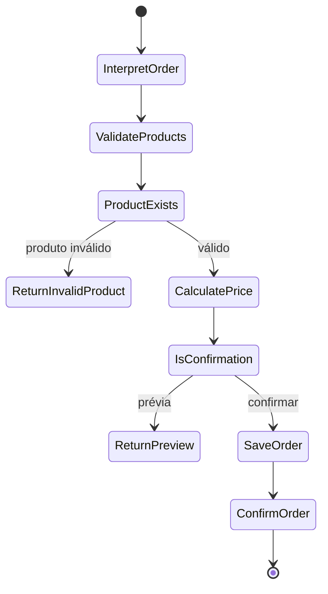

<div align="center">

# 🍕 Delivery AI Assistant

### Peça comida conversando. A IA entende, monta o pedido e uma arquitetura 100% serverless na AWS cuida do resto.

[](https://aws.amazon.com/)
[](https://aws.amazon.com/bedrock/)
[](https://react.dev/)
[](https://www.typescriptlang.org/)
[](#-licença)

**[Ver Demo](#-como-rodar) · [Arquitetura](#-arquitetura-aws) · [Endpoints](#-api) · [Deploy na AWS](#-deploy-na-aws)**

</div>

---

## ✨ O que é isso?

Você digita: **"quero 1 pizza calabresa e 2 cocas"**
A IA entende, monta o resumo do pedido, você confirma — e por trás disso, uma esteira completa de serviços **AWS** processa tudo de ponta a ponta, sem servidor nenhum para gerenciar.

Não é só um chat bonito. É um projeto de portfólio que mostra, na prática, como interpretar linguagem natural com **Amazon Bedrock**, orquestrar um fluxo de negócio real com **Step Functions**, e persistir dados em **DynamoDB** — tudo com IAM de mínimo privilégio e observabilidade completa.

> 💡 **Sem configurar nada**, o projeto já roda em modo demonstração com dados mockados. Quando você conecta a AWS, a **mesma interface** passa a usar a infraestrutura real — zero mudança na experiência do usuário.

---

## 🏗️ Arquitetura AWS

Um pedido percorre um pipeline **serverless orquestrado** — cada etapa é uma função Lambda independente, coordenada pelo Step Functions:



**Por que essa arquitetura conta uma boa história:**

| Serviço AWS | Papel | Por que importa |
|---|---|---|
| 🚪 **API Gateway** | Porta de entrada HTTP | Escala sob demanda, sem servidor fixo |
| ⚡ **Lambda + AWS SDK v3** | Lógica de negócio | Funções pequenas, independentes e baratas |
| 🔀 **Step Functions Express** | Orquestração do pedido | Cada transição é visível, com retries e tratamento de erro |
| 🧠 **Amazon Bedrock** | Interpretação de linguagem natural | IA sem precisar hospedar ou treinar modelo |
| 🗄️ **DynamoDB** | Persistência | Baixa latência, com GSI para consultas por data |
| 📊 **CloudWatch + X-Ray** | Observabilidade | Logs e rastreamento distribuído ponta a ponta |
| 🔐 **IAM** | Segurança | Cada Lambda tem exatamente a permissão que precisa — nem mais, nem menos |

A validação de preço e produto acontece **duas vezes**: uma na prévia, outra na confirmação — dentro do Step Functions. Isso garante que nada vindo direto do navegador (preço, item) seja confiado sem revalidação no servidor.

---

## 🚀 Como rodar

### Opção 1 — Modo local (sem AWS, sem Docker, sem custo)

```bash
# Backend (emula API Gateway + Step Functions + DynamoDB)
cd backend && npm install && npm run dev

# Frontend, em outro terminal
npm install && npm run dev
```

Acesse **`http://localhost:8080`** — pronto, já tem um assistente de delivery funcionando com 4 pedidos de exemplo.

### Opção 2 — Deploy real na AWS

```bash
cd backend && npm install && cd ..
sam build
sam deploy --guided --parameter-overrides AllowedOrigin=http://localhost:8080
```

O **AWS SAM** cria toda a infraestrutura sozinho: tabela DynamoDB + GSI, API Gateway, Lambdas, roles IAM e a State Machine. Você só precisa apontar o `VITE_API_BASE_URL` para o `ApiUrl` gerado.

---

## 🔌 API

| Método | Rota | Uso |
|---|---|---|
| `POST` | `/orders` | Envia o prompt em linguagem natural → recebe a prévia do pedido |
| `POST` | `/orders` | `{ action: "confirm" }` → confirma e persiste o pedido |
| `GET` | `/orders` | Lista o histórico, com paginação |
| `GET` | `/orders/{id}` | Busca um pedido específico |
| `GET` | `/dashboard` | Métricas e série dos últimos 7 dias |

---

## 🧠 Fluxo do Step Functions



Definição completa em [`backend/statemachine/order-workflow.asl.json`](https://github.com/wallace-2105/chat-delivery-ai/blob/main/backend/statemachine/order-workflow.asl.json).

---

## 🛠️ Stack completa

**Frontend:** React 19 · TypeScript · Vite · Tailwind · shadcn/ui
**Backend/Cloud:** API Gateway · AWS Lambda · Step Functions Express · Amazon Bedrock · DynamoDB · CloudWatch · X-Ray · IAM
**Infra como código:** AWS SAM

---

## 🗺️ Roadmap

- [ ] Autenticação com Amazon Cognito
- [ ] Eventos em tempo real do Step Functions (WebSocket/SSE)
- [ ] Catálogo administrativo em DynamoDB
- [ ] Agregações via DynamoDB Streams
- [ ] Integração com pagamento e notificações
- [ ] Testes unitários e de contrato das Lambdas

---

## 📄 Licença

MIT — veja o arquivo de licença. Consulte a política da sua organização antes de usar chaves, dados de clientes ou modelos de IA em produção.

<div align="center">

**⭐ Se esse projeto te ajudou a entender arquiteturas serverless na AWS, deixa uma estrela!**

</div>
