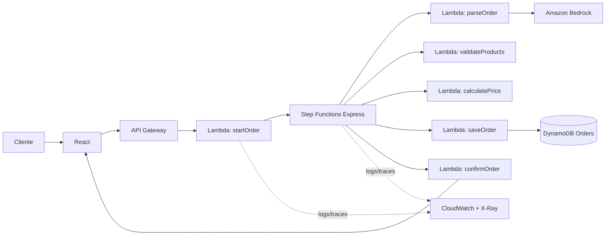
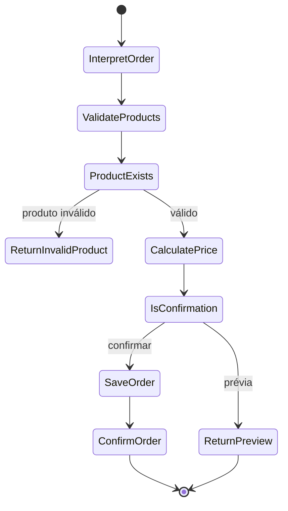

# Delivery AI Assistant

Assistente de delivery conversacional que transforma linguagem natural em pedidos revisáveis. O projeto combina uma interface React já existente com uma arquitetura AWS serverless: o usuário conversa, confere o resumo, confirma o pedido e acompanha a operação.

> Sem `VITE_API_BASE_URL`, a aplicação funciona em modo demonstração com dados mockados. Ao configurar a URL do API Gateway, a mesma interface usa a API AWS.

## Objetivo

Demonstrar uma solução de portfólio com React, TypeScript, Amazon Bedrock e serviços serverless. A separação entre interface, API, orquestração e persistência deixa o fluxo testável e pronto para evoluir sem alterar a experiência visual.

## Tecnologias

| Camada          | Tecnologia                                       | Por que foi escolhida                                                                               |
| --------------- | ------------------------------------------------ | --------------------------------------------------------------------------------------------------- |
| Front-end       | React 19, TypeScript, Vite, Tailwind e shadcn/ui | Desenvolvimento tipado, rápido e consistente com os componentes existentes.                         |
| API             | Amazon API Gateway REST                          | Expõe endpoints HTTP gerenciados, com CORS e escala sob demanda, sem manter servidor.               |
| Computação      | AWS Lambda + AWS SDK v3                          | Funções pequenas e independentes; o SDK modular reduz dependências carregadas.                      |
| Orquestração    | AWS Step Functions Express                       | Mostra cada transição do pedido e permite retries/erros; Express responde ao chat de modo síncrono. |
| IA              | Amazon Bedrock                                   | Interpreta mensagens abertas sem hospedar ou operar um modelo de IA.                                |
| Dados           | Amazon DynamoDB                                  | Banco serverless de baixa latência, com GSI para consultar o histórico por data.                    |
| Observabilidade | CloudWatch e X-Ray                               | Logs por Lambda e rastros entre API, funções e workflow.                                            |
| Segurança       | IAM                                              | Cada função recebe apenas as permissões de que precisa.                                             |

## Arquitetura



O POST de prévia processa a conversa até o cálculo do total. A confirmação reenfileira o resumo no workflow, valida os SKUs novamente e só então persiste o pedido. Isso evita confiar em preço ou item que venha diretamente do navegador.

## Fluxo do Step Functions



O arquivo executável do fluxo fica em [backend/statemachine/order-workflow.asl.json](backend/statemachine/order-workflow.asl.json). A timeline na tela Assistente usa os mesmos nomes de etapas e está preparada para receber eventos reais no futuro.

## Endpoints

| Método | Rota           | Uso                                                                                                            |
| ------ | -------------- | -------------------------------------------------------------------------------------------------------------- |
| `POST` | `/orders`      | Envia `{ prompt, currentSummary }` para obter a prévia; envia `{ action: "confirm", summary }` para confirmar. |
| `GET`  | `/orders`      | Lista pedidos; aceita `limit`, `cursor` e `pagination=true`.                                                   |
| `GET`  | `/orders/{id}` | Retorna um pedido pelo identificador.                                                                          |
| `GET`  | `/dashboard`   | Retorna métricas e série dos últimos sete dias.                                                                |

## Executar o front-end

```bash
bun install
bun run dev
```

Ou use `npm install` e `npm run dev`. A aplicação abre em `http://localhost:8080`.

Para conectá-la à AWS, crie `.env.local` na raiz:

```env
VITE_API_BASE_URL=https://SEU_API_ID.execute-api.SUA_REGIAO.amazonaws.com/prod
```

Reinicie o Vite depois de alterar a variável. Não coloque credenciais AWS no front-end.

---

## Executando Localmente

O backend roda localmente como um servidor Express que emula o API Gateway, o Step Functions e o DynamoDB — **sem precisar de Docker, AWS CLI ou conta AWS**.

### Pré-requisitos

- Node.js 18+ (recomendado: 20+)
- npm 9+

### 1. Instalar dependências do backend

```bash
cd backend
npm install
```

### 2. Iniciar o backend

```bash
# Modo desenvolvimento (reinicia automaticamente ao salvar arquivos)
npm run dev

# Ou modo simples
npm start
```

O servidor sobe em **`http://localhost:3001`** e exibe:

```
╔══════════════════════════════════════════════════╗
║  🚀  Delivery AI — servidor local iniciado       ║
╠══════════════════════════════════════════════════╣
║  API:      http://localhost:3001                ║
║  CORS:     http://localhost:8080                 ║
║  Bedrock:  fallback (aliases)                    ║
╚══════════════════════════════════════════════════╝
```

O servidor vem pré-carregado com 4 pedidos de demonstração.

### 3. Conectar o frontend ao backend local

Na raiz do projeto, crie o arquivo `.env.local`:

```env
VITE_API_BASE_URL=http://localhost:3001
```

### 4. Iniciar o frontend

Abra um novo terminal (mantendo o backend rodando):

```bash
# Na raiz do projeto
npm install      # ou: bun install
npm run dev      # ou: bun run dev
```

Acesse **`http://localhost:8080`**.

### 5. Testar a API diretamente

```bash
# Status do servidor
curl http://localhost:3001/health

# Pedir uma prévia de pedido (interpreta linguagem natural)
curl -X POST http://localhost:3001/orders \
  -H "Content-Type: application/json" \
  -d '{"prompt": "quero 1 pizza calabresa e 2 cocas"}'

# Confirmar um pedido (use o summary retornado acima)
curl -X POST http://localhost:3001/orders \
  -H "Content-Type: application/json" \
  -d '{
    "action": "confirm",
    "summary": {
      "items": [{"id":"pizza-calabresa-g","name":"Pizza de Calabresa (G)","quantity":1,"unitPrice":54.9}],
      "subtotal": 54.9,
      "deliveryFee": 7.9,
      "total": 62.8
    },
    "customer": "João"
  }'

# Listar histórico de pedidos
curl http://localhost:3001/orders

# Buscar pedido por ID
curl http://localhost:3001/orders/DA-local-001

# Métricas do dashboard
curl http://localhost:3001/dashboard
```

### Interpretação de pedidos sem IA (modo padrão)

Sem configurar credenciais AWS, o servidor usa um **parser local por aliases do catálogo**. Ele reconhece:

| Produto | Exemplos de frases aceitas |
|---|---|
| Pizza de Calabresa (G) | "pizza calabresa", "calabresa" |
| Pizza Marguerita (G) | "pizza marguerita", "marguerita" |
| Coca-Cola 2L | "coca cola", "coca", "refrigerante" |
| Brownie com sorvete | "brownie" |
| Batata rústica | "batata" |

### Usar Amazon Bedrock (IA real) localmente

Se você tiver credenciais AWS com acesso ao Bedrock, crie `backend/.env.local`:

```env
AWS_REGION=us-east-1
AWS_ACCESS_KEY_ID=sua_access_key
AWS_SECRET_ACCESS_KEY=sua_secret_key
BEDROCK_MODEL_ID=anthropic.claude-3-haiku-20240307-v1:0
```

Reinicie o servidor. A IA interpretará qualquer mensagem em linguagem natural.

---


Pré-requisitos: AWS CLI autenticada, [AWS SAM CLI](https://docs.aws.amazon.com/serverless-application-model/latest/developerguide/install-sam-cli.html), Node.js 20 e acesso ao modelo do Bedrock na região escolhida.

```bash
cd backend
npm install
cd ..
sam build
sam deploy --guided --parameter-overrides AllowedOrigin=http://localhost:8080
```

Durante o deploy, anote o output `ApiUrl` e configure-o em `VITE_API_BASE_URL`. O SAM cria a tabela, o GSI `byCreatedAt`, API Gateway, Lambdas, roles IAM e State Machine. Não é necessário criar a tabela manualmente.

### Habilitar o Amazon Bedrock

1. Abra o console Amazon Bedrock na mesma região do deploy.
2. Em **Model access**, solicite/ative acesso ao modelo configurado em `BedrockModelId` (o padrão é Claude 3 Haiku).
3. Se sua região não oferecer esse modelo, passe um ID disponível e compatível com o formato Anthropic ao `sam deploy`:

```bash
sam deploy --parameter-overrides BedrockModelId=SEU_MODELO AllowedOrigin=https://seu-dominio.com
```

O IAM de `parseOrder` fica restrito ao ARN desse modelo. Esse detalhe é proposital: permissões mínimas limitam o alcance da função.

## Estrutura

```text
src/                           # interface React
  components/                  # chat, resumo, timeline e layout
  routes/                      # Home, Assistente, Dashboard, Pedidos, Arquitetura e Sobre
  services/api.ts              # gateway entre UI, mocks locais e API Gateway
backend/
  src/domain/                  # DTOs e catálogo
  src/services/                # integração Bedrock via AWS SDK v3
  src/repositories/            # persistência DynamoDB
  src/handlers/                # Lambdas independentes
  statemachine/                # definição ASL
template.yaml                  # infraestrutura SAM/IAM/API/DynamoDB/Step Functions
```

## Screenshots

Após executar o projeto, registre as telas em `docs/` para completar o portfólio:

| Assistente            | Dashboard            | Arquitetura AWS        |
| --------------------- | -------------------- | ---------------------- |
| `docs/assistente.png` | `docs/dashboard.png` | `docs/arquitetura.png` |

## Qualidade e segurança

- Tipos e DTOs na borda de cada Lambda; catálogo e cálculo de preço são autoritativos no servidor.
- Repositório DynamoDB isolado da regra de negócio.
- Step Functions contém os caminhos de decisão e retry de integrações Lambda.
- Lambdas registram erros no CloudWatch e recebem tracing X-Ray.
- CORS deve ser restringido ao domínio publicado em produção; evite usar `*` fora de desenvolvimento.

## Roadmap

- [ ] Autenticação de clientes com Amazon Cognito.
- [ ] Eventos reais do Step Functions na timeline (WebSocket/SSE).
- [ ] Catálogo administrativo em DynamoDB.
- [ ] Agregados diários via DynamoDB Streams para dashboard de grande volume.
- [ ] Integração com pagamento, cozinha e notificações.
- [ ] Testes unitários e de contrato das Lambdas.

## Licença

MIT. Consulte a política da sua organização antes de usar chaves, dados de clientes ou modelos de IA em produção.
